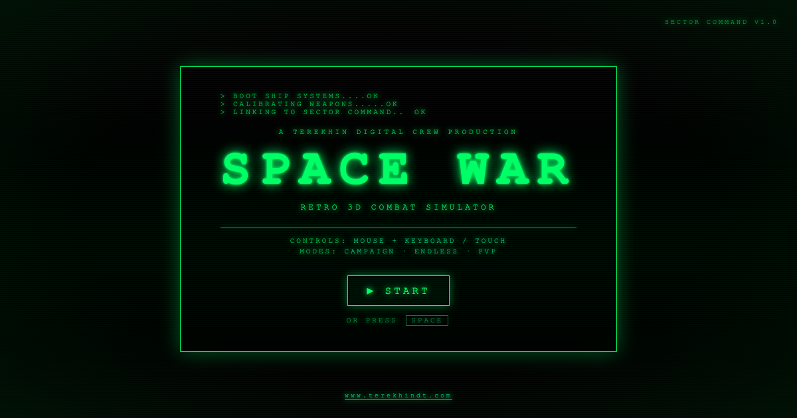

# SPACE WAR



A retro 3D space-combat arcade game — a single self-contained `index.html`
built with [Three.js](https://threejs.org/). Six-degrees-of-freedom dogfighting,
a four-mission campaign, an upgrade economy, 32 achievements **and a 2–4 player
free-for-all deathmatch**, in the spirit of *Elite* (1984) and *Spacewar!*.

**▶ Play it now: <https://terekhinandrei.github.io/space-war/>**

No build step, no install — open the link and fly. A production of
[Terekhin Digital Crew](https://www.terekhindt.com).

---

## Share it

The link is the shareable artefact:

> **Play SPACE WAR — retro 3D dogfight in your browser. Campaign + 2-4
> player PvP, no install.**
> <https://terekhinandrei.github.io/space-war/>

Open Graph / Twitter Card metadata is wired in — pasting the URL into
Discord, Telegram, Slack, X / Twitter, LinkedIn, Facebook or iMessage
produces a rich preview card with the `preview.png` promo image, title,
and description.

On the title screen there's also a **⤴ SHARE GAME** button: on
mobile / Chrome it opens the native share sheet; everywhere else it
copies the link to the clipboard.

### Where to post

- **itch.io** — upload `index.html` + `preview.png` + `server/` +
  `shared/` as a zip, or paste the live URL. Tag *space*,
  *multiplayer*, *retro*, *threejs*, *wireframe*.
- **r/WebGames, r/IndieDev, r/PromoteYourGame, r/incremental_games**
  — Reddit communities that welcome browser-game posts.
- **Hacker News (Show HN)** — works well for the "single HTML file +
  Three.js + multiplayer" angle.
- **TIGSource forums**, **devlog Twitter / Bluesky** — long-form posts
  about the build (Phases 0-5 of the multiplayer plan are good
  material).
- **r/ThreeJS, r/PartyKit** — engine / runtime specific audiences.

---

## Features

- **6DOF flight** — thrust, strafe and roll through an open star field with
  drifting asteroids and a friendly station.
- **7 enemy types** — Scout, Interceptor, Gunship, Cruiser, Bomber, Ace and the
  campaign-finale Dreadnought, each with distinct stats and behaviour.
- **Squadron AI** — enemies fly in formations with leaders, commit to *Elite*-style
  attack runs, pull pincer manoeuvres and switch to avenge mode when a wingman dies.
- **3 weapons** — Laser (burst alpha), Pulse (sustained spray) and lock-on
  Missiles.
- **Power distribution** — cycle COMBAT / BALANCED / EVASIVE to trade fire rate,
  shield regen and damage on the fly.
- **Campaign + Endless** — four story operations that unlock in order, plus a
  free Endless Battle mode for high scores.
- **Upgrade economy** — credits earned in combat buy six permanent ship upgrades
  at the station's Upgrade Bay.
- **Station docking** — fly in slow and dock for a full repair, rearm and access
  to the shop.
- **32 achievements** — a data-driven progression layer across five categories
  (Progression, Combat, Mastery, Challenge and a hidden Classified tier), each
  with a credit bounty.
- **Desktop & mobile** — mouse + keyboard, or a touch UI with dual virtual sticks.
- **Adjustable graphics** — High / Medium / Low presets in Settings.

## Controls

### Keyboard & mouse

| Input | Action |
|---|---|
| Mouse | Aim (yaw / pitch) |
| `LMB` / `Space` | Fire |
| `W` `S` | Thrust forward / back |
| `A` `D` | Strafe |
| `Q` `E` | Roll |
| `1` `2` `3` | Laser / Pulse / Missiles |
| `Shift` | Boost |
| `X` | Brake |
| `Tab` | Cycle power distribution |
| `M` | Mute |
| `Esc` | Pause |

### Touch (mobile)

- **Left stick** — steer (yaw / pitch)
- **Right stick** — thrust and strafe
- **FIRE** — auto-fire toggle · **BOOST** · **WPN** — switch weapon
- Tap **II** to pause

Missiles need a target lock — keep an enemy in your front cone.

## Missions

The campaign unlocks one operation at a time:

1. **Sector Sweep** — eliminate the pirate patrol.
2. **Station Defense** — hold off bomber squadrons and protect the station.
3. **Ace Hunt** — break through escort waves and assassinate the enemy ace.
4. **Flagship Assault** — the finale: destroy the Dreadnought.

**Endless Battle** is always available — escalating waves, pure high-score chase.

## Achievements

32 achievements drive long-term engagement; each unlock grants credits that
feed straight back into the upgrade economy:

- **Progression** — the guided first-hour path.
- **Combat** — lifetime kill milestones and the enemy bestiary.
- **Mastery** — score, wave-survival and full-loadout skill ceilings.
- **Challenge** — deliberate no-damage and low-hull runs.
- **Classified** — secret achievements, hidden until earned.

Open the **Achievements** screen from the start menu or mission select to track
progress.

## Running locally

The game is a static file — any HTTP server works (it must be served over
HTTP, not opened as a `file://` URL, because of the ES-module import map).

```sh
# Python
python3 -m http.server 8000 --bind 127.0.0.1
# then open http://127.0.0.1:8000

# or Node
npx --yes serve . -l 8001
```

Dev-server configurations are stored in `.claude/launch.json`.

## Tech stack

- **Three.js 0.160.0** — loaded from a CDN via an ES-module import map.
- **WebGL** rendering with `EffectComposer` + `UnrealBloomPass` for the retro glow.
- **Web Audio API** — all sound effects synthesised at runtime, no audio assets.
- **localStorage** — progress, upgrades, settings and achievements persist
  under the key `space_war_save_v1`.

Everything — markup, styles and game logic — lives in one `index.html`.

## License

Free to play, study and modify.
